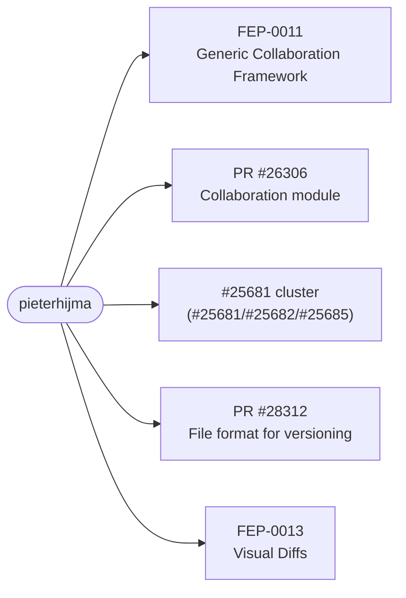
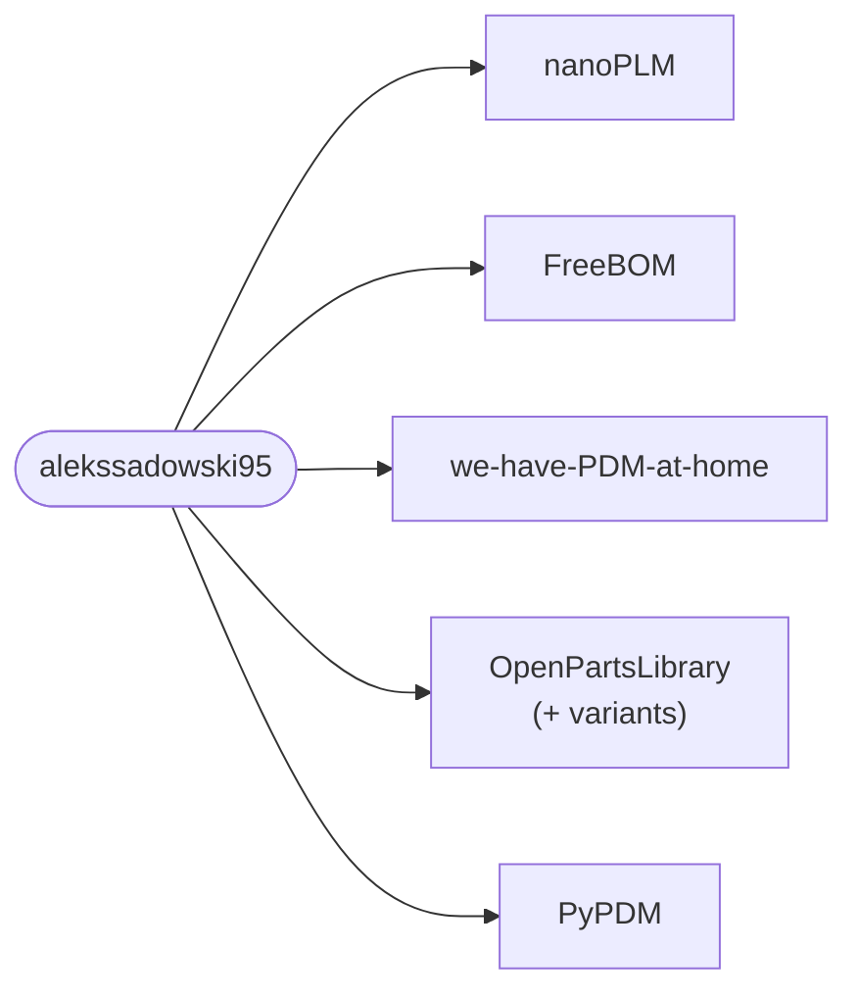
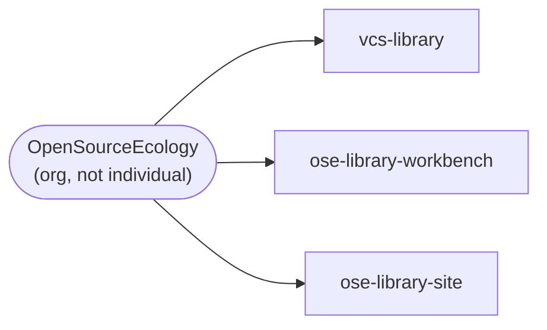
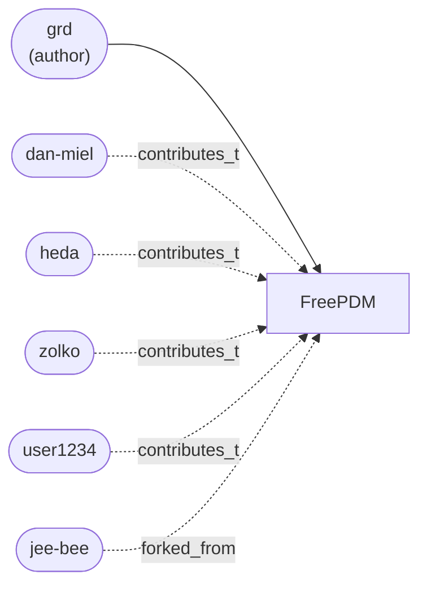
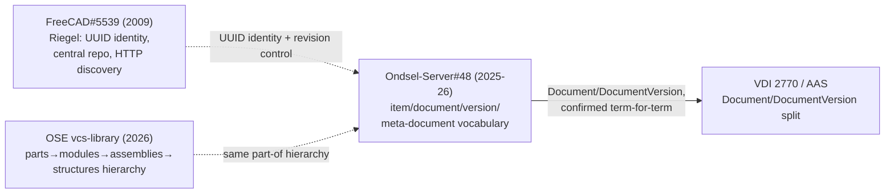
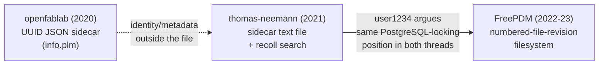
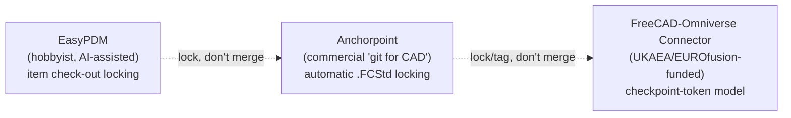
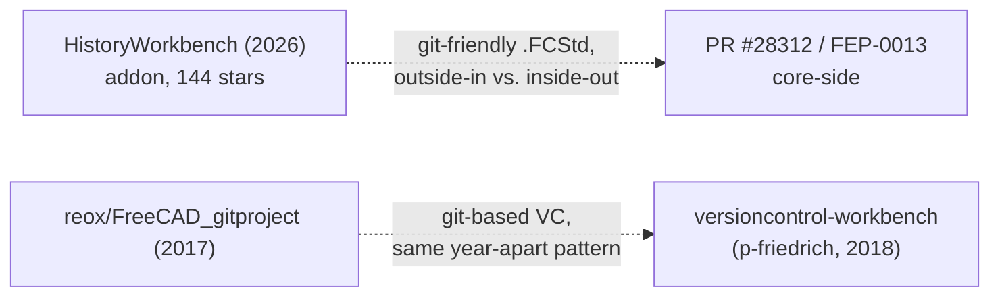
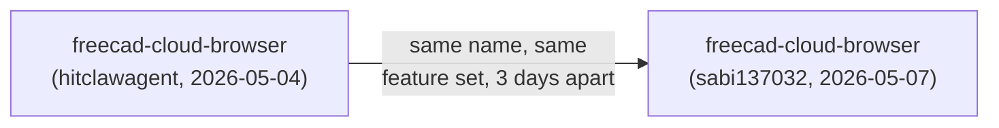
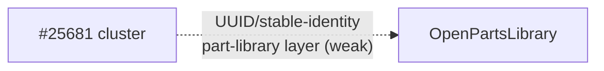

# Ecosystem Relationship Mapping — Stage 4 Visualizations

Focused views generated from `ecosystem_graph.yaml` (95 nodes / 61 edges,
Stage 3 full extraction), per `ecosystem_relationship_mapping_plan.md`'s
Stage 4 instruction: multiple small purpose-built diagrams instead of one
unreadable 30+-node graph. Each diagram below covers one relationship
pattern and stays under ~12 nodes. Node/edge ids in captions refer directly
to `ecosystem_graph.yaml` so every claim here is checkable against the
source structure (and, through it, the source prose).

See `ecosystem_relationship_findings.md` for the narrative that these
diagrams support.

## 1. Personal and institutional ecosystem clusters

The `same_author`/`contributes_to` pattern: one person (or, in one case,
one organization) driving a whole cluster of interlocking projects. The
census flags this pattern at three distinct scales — shown here as three
separate small diagrams rather than one tangled fan-out graph, since mixing
them would obscure that this is the *same pattern recurring*, not one big
cluster.

### 1a. `person:pieterhijma` — individual scale, FreeCAD core

*Source: `same_author` edge, `person:pieterhijma` → 5 project nodes,
`freecad_core_and_lens_collaboration_issues.md` §1-9. Sole driver of
FreeCAD core's entire official collaboration effort — a single-person
bus-factor risk sitting at the center of the most institutionally-endorsed
initiative in the whole census.*

### 1b. `person:alekssadowski95` — individual scale, small-manufacturer PDM

*Source: `same_author` edge, `person:alekssadowski95` → 5 project nodes,
`freecad_pdm_plm_ecosystem_census.md` §10.9. A second independent
same-scale personal ecosystem, unrelated to pieterhijma's, built toward
"PDM for small manufacturers" rather than FreeCAD-core collaboration.*

### 1c. `person:ose-org` (Open Source Ecology) — institutional scale

*Source: `same_author` edge, `person:ose-org` → 3 project nodes,
`freecad_pdm_plm_ecosystem_census.md` §10.9-10.10. Same fan-out pattern as
1a/1b, but the "author" is an institution, and all three repos were pushed
coordinatedly on the same day (2026-09-07) — the pattern generalizes from
individuals to organizations.*

### 1d. Smaller `contributes_to` webs around FreePDM and Ondsel-Server

Not full same-author clusters, but worth showing as a fourth, different
shape: several people sustaining one project without having authored it.

*Source: `same_author` (grd), `contributes_to` (dan-miel, heda, zolko,
user1234), and `forked_from` (jee-bee) edges all targeting
`project:freepdm`, `freecad_pdm_plm_ecosystem_census.md` §16.1-16.2. One
author, five distinct sustained non-authoring relationships — the
`contributes_to` edge type (added at the Stage 2 freeze) exists precisely
to make this shape visible instead of force-fitting everyone into
`same_author`.*

## 2. `independently_reinvents`, grouped by `shared_idea`

The plan calls this "probably the single most compelling visual this data
could produce." All 11 `independently_reinvents` edges in the graph, split
into six idea-clusters so each stays legible. Dotted arrows mark
`confidence: inferred`; solid arrows mark `confidence: confirmed`.

### 2a. Identity, central revision control, and standards — three origins, 16+ years

*Sources: `discussion:freecad-issue-5539`→`discussion:ondsel-server-48`
(inferred, `freecad_core_and_lens_collaboration_issues.md` §0);
`discussion:ondsel-server-48`→`standard:vdi-2770-aas` (**confirmed** — the
one `independently_reinvents` edge with primary-source-stated
correspondence, §5 comment 5.1); `project:ose-vcs-library`→
`discussion:ondsel-server-48` (inferred, `freecad_pdm_plm_ecosystem_census.md`
§10.10). Four independent origins — FreeCAD's founder, FreeCAD's current
team, an international standards body, and an open-hardware institution —
converging on the same core vocabulary without citing each other.*

### 2b. Sidecar identity — one person, two threads, six months apart

*Sources: `person:openfablab`→`person:thomas-neemann` (inferred,
`freecad_pdm_plm_ecosystem_census.md` §16.3a); `person:thomas-neemann`→
`project:freepdm` (**confirmed** — `person:user1234`'s continuity across
both threads is directly traceable, not inferred, §16.3a). The most
concrete "one person unknowingly re-running their own argument" case in the
census.*

### 2c. "Lock, don't merge" — hobbyist, commercial, government-funded

*Sources: `project:easypdm`→`project:anchorpoint` and
`project:anchorpoint`→`project:freecad-omniverse-connector`, both inferred,
`freecad_pdm_plm_ecosystem_census.md` §10.1, §14.2. Same conflict-avoidance
strategy across three unrelated funding models and contexts.*

### 2d. "Make .FCStd git-friendly" — the most duplicated sub-problem in the census

*Sources: `project:historyworkbench`→`project:pr-28312` (inferred,
`freecad_pdm_plm_ecosystem_census.md` §10.2) and
`project:freecad-gitproject-reox`→`project:versioncontrol-workbench-pfriedrich`
(inferred, same section). Per the HistoryWorkbench node's own note, at
least five other independent attempts exist in the census
(`freecad-git-tryout-levity0815`, `cadracks-freecad-workbench-git`, plus
these two) — only the two clearest pairs are edged here to keep the
diagram legible; see §10.2 in the census for the rest.*

### 2e. Duplicate scaffolding within days

*Source: `project:freecad-cloud-browser-hitclawagent`→
`project:freecad-cloud-browser-sabi137032` (**confirmed**,
`freecad_pdm_plm_ecosystem_census.md` §11.4). The tightest-timescale
reinvention in the census — not an idea reinvented years apart, but a
near-identical project rebuilt from scratch three days after the first one
existed.*

### 2f. Speculative overlap (lowest-confidence edge in the graph)

*Source: `project:issue-25681-cluster`→`project:openpartslibrary`
(inferred, `freecad_pdm_plm_ecosystem_census.md` §10.4, §10.9). Kept
separate from the other clusters deliberately — this is the pilot's own
"test whether the taxonomy handles a lower-confidence case" edge (see
`ecosystem_relationship_mapping_results.md`), and it shouldn't be visually
conflated with the much better-evidenced clusters above.*

## 3. `technical_approach` facet overlap

A table, not a graph, per the plan's explicit instruction — better suited
to spotting overlap. Grouped by approach (rather than one 57-row × 8-column
incidence matrix) so clusters are visible at a glance; the full per-project
facet values live in `ecosystem_graph.yaml` for anyone who wants the raw
matrix. Counts sum to 58 because `project:ondsel-server` carries two
approach values.

| `technical_approach` | Count | Projects |
|---|---|---|
| `other` | 23 | fep-0011, pr-26306, fep-0013, issue-25681-cluster, bcf-plugin-freecad, ondsel-lens-addon, easypdm, pistock, cascadia-freecad-connector, cascadia-app, taack-plm, cadbaselibrary, freecad-parts-library, cadcloud, ose-vcs-library, ose-library-workbench, ose-library-site, speckle-opencascade, freecad-web-virtastic, magiknet-freecad-port, freecad-cloud-browser-hitclawagent, freecad-cloud-browser-sabi137032, ifcopenshell |
| `unknown` | 15 | nanoplm, freebom, openpartslibrary, pypdm, pdmworkbench-zhurbav, pdmforfreecad-danmiel, schumbi-freecad-plm, fc-plm-ojo42, cadracks-freecad-workbench-plm, versioncontrol-workbench-pfriedrich, billofmaterials-wb, cadracks-openplm, openplm-cpg-retail, uesoft-autopdms, plmore |
| `git` | 7 | pr-28312, gitpdm, historyworkbench, freecad-gitproject-reox, freecad-git-tryout-levity0815, cadracks-freecad-workbench-git, anchorpoint |
| `sql-database` | 4 (+ ondsel-server) | openplm, odooplm, docdoku-plm, cadracks-opm, **ondsel-server** |
| `server-checkin-checkout` | 4 (+ ondsel-server) | grabcad-workbench, freecad-omniverse-connector, comet-cdp4, **ondsel-server** |
| `p2p-crdt` | 2 | collaborativefc-ocp, jupytercad |
| `custom-filesystem-permissions` | 1 | freepdm |
| `svn` | 1 | we-have-pdm-at-home |
| `nosql-database` | 0 | *(no project in the census confirmed as using this — a gap, not a finding: several forum proposals, e.g. Malkov's 2017 NoSQL pitch, never shipped)* |

**What this surfaces:** `git` (7) and the combined
`sql-database`/`server-checkin-checkout` "central server" family (8, once
`ondsel-server`'s double-count is resolved) are the two real architectural
camps with enough members to call clusters — exactly the "filesystem-
permission-based vs. database-backed" split the plan's opening questions
anticipated, except `git` turns out to be the dominant camp, not a footnote
to either. `custom-filesystem-permissions` has exactly one member
(FreePDM itself) — its own Phase 4 pivot, per §16.2, was not joining an
existing camp but inventing a third one, alone. The `other`/`unknown`
combined total (38 of 58, roughly two-thirds) is itself a finding: the
`technical_approach` facet as currently defined is too coarse to
discriminate most of the census — see the recommendation in
`ecosystem_relationship_mapping_results.md` for whether this facet's
enumerated values need revisiting in a future pass, since this pass (Stage
4) is read-only against the frozen graph and doesn't correct it directly.
